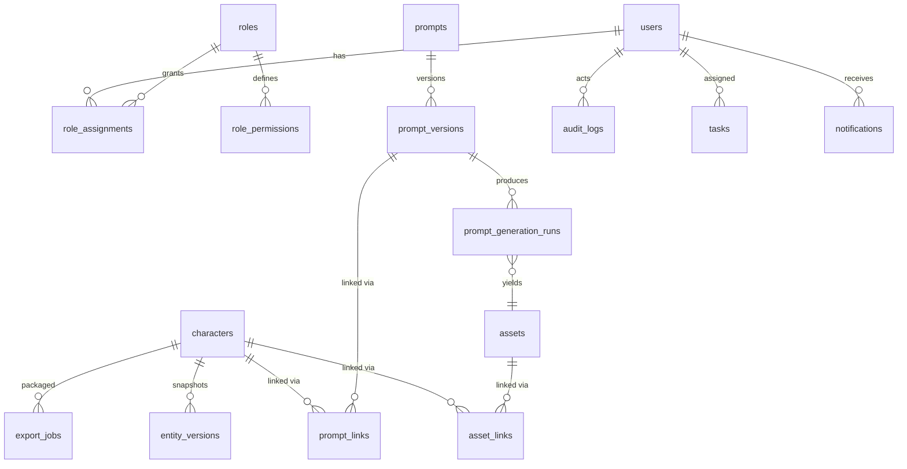

# AISTAR Talent OS — SRS/PRD v0.2 Addendum

**ใช้คู่กับ:** `aistar_talent_os_srs_prd_v0_1.md` (เอกสารหลัก)
**อ้างอิง:** `aistar_talent_os_prd_review_v0_1.md` (ผลรีวิว 6 มุมมอง + Decision Log D1–D10)
**วันที่:** 2026-07-11
**สถานะ:** Draft — รอพี่ทัศน์ review

เอกสารนี้เติม spec ที่ v0.1 ขาด และแก้ส่วนที่ขัดแย้ง โดยยึด Decision D1–D10 ทุกข้อที่ขัดกับ v0.1 ให้ยึดเอกสารนี้

---

# A. Decision Register (สรุปจาก Decision Log)

| # | คำตัดสิน |
|---|---|
| D1 | ไม่ทำ PDPA |
| D2 | ไม่ทำ SaaS — single-tenant ใช้ภายในเท่านั้น (แก้ §1.3 v0.1: ตัดคำว่า "ต่อยอด SaaS") |
| D3 | ผู้ใช้ = ทีม AISTAR หลายคน → คง Roles + Approval workflow |
| D4 | AI Video Platform หลายเจ้า (รวม Grok) และจะเพิ่มเรื่อยๆ → Prompt Library เป็น platform-agnostic |
| D5 | ตัด Obsidian Sync ออกจาก Phase 1 (เลื่อนไป Phase 3+) — Phase 1 มีแค่ Export Markdown/JSON ให้ดาวน์โหลด |
| D6 | Performance Data = manual entry + CSV import |
| D7 | Stack: NestJS (API + workers) + Next.js (frontend), REST, PostgreSQL, Redis/BullMQ |
| D8 | AI (MCP/GPT) Phase 1 = read + create/edit draft เท่านั้น — ห้าม approve/publish/rollback/delete (enforce ฝั่ง server) |
| D9 | Auth = Email + Password |
| D10 | ไม่ทำ import tool — ข้อมูลเดิมกรอกใหม่ผ่าน AI wizard |

**Default ที่เสนอเพิ่ม (ยังแก้ได้):**
- **LLM:** เริ่มด้วย provider เดียวผ่าน abstraction layer (เปลี่ยน/เพิ่มเจ้าได้ทีหลัง), log ทุก call (model, tokens, cost), budget alert รายเดือน
- **Backup:** PostgreSQL daily backup + WAL (PITR), Object storage เปิด versioning, retention 30 วัน — เป้า RPO ≤ 24 ชม. / RTO ≤ 8 ชม.
- **Search:** Meilisearch (รองรับตัดคำไทย) ตั้งแต่ Phase 1

---

# B. Architecture (แก้ §23 ของ v0.1)

## B.1 Topology

```text
Next.js (frontend)
   │ REST (JSON) + SSE (AI streaming)
   ▼
NestJS API  ──────────────► PostgreSQL
   │  │                        ▲
   │  └── MCP Server (facade บน service layer เดียวกัน — ห้าม bypass)
   │
   ├── BullMQ (Redis) ──► Workers: export ZIP/PDF, thumbnail/preview,
   │                      AI batch jobs, embedding, markdown generator
   ├── Object Storage (R2/S3) — private bucket + presigned URL เท่านั้น
   └── Meilisearch — index: characters, prompts, ideas, content
```

หลักการ:
1. **Modular monolith** — NestJS โปรเจกต์เดียว แยกเป็น module ตาม domain, ไม่แตก microservices
2. **MCP = facade** บน service layer เดียวกับ REST — สืบทอด permission + audit เหมือนกันทุก path
3. **งาน > 5 วินาทีเป็น background job เสมอ** (export, transcode, AI batch) — มี `jobs` status ให้ UI poll
4. **Asset upload = presigned URL** ตรงเข้า storage ไม่ผ่าน API server, worker ตามไป generate thumbnail/preview/embedding
5. Environments: `dev` / `production` (staging เพิ่มเมื่อทีมโตขึ้น), Docker, secrets ใน env vault ห้าม commit

## B.2 Authentication (D9)

- Email + Password: bcrypt/argon2, ความยาวขั้นต่ำ 10, rate limit login 5 ครั้ง/นาที, lockout ชั่วคราว
- JWT access token (อายุ 15 นาที) + refresh token (7 วัน, revoke ได้) — พนักงานออก: admin revoke ทุก session
- Password reset ผ่าน email link (อายุ 30 นาที)
- MFA: ยังไม่บังคับใน Phase 1 (backlog)

---

# C. Permission Matrix (ปิด Critical #1)

Actions: **V**=View, **C**=Create/Edit draft, **A**=Approve, **P**=Publish/Schedule, **E**=Export/Download package, **X**=Admin (user/permission/config)

| Role | Character | Asset | Prompt | Campaign | Episode/Shot | Content Cal. | Live | Performance | Competitor | Idea/Post-it | Rights | QC |
|---|---|---|---|---|---|---|---|---|---|---|---|---|
| Admin | VCAE+X | VCAE+X | VCAE+X | VCAE+X | VCAE+X | VCAPE+X | VCAPE+X | VC+X | VC+X | VC+X | VCA+X | VCA+X |
| Founder/Management | V A E | V | V | VCA | V | V A | V A | V | V | VC | VCA | V |
| Creative Lead | VCAE | VCA | VCA | VCA | VCA | V A | V | V | V | VC | V | VCA |
| Character Designer | VC | VC | V | V | V | — | — | — | V | VC | — | V |
| Script Writer | V | V | V | V | VC | V | — | — | V | VC | — | — |
| Prompt Engineer | V | VC | VCA | V | V | — | — | V | V | VC | — | V |
| AI Video Operator | V | VC | V | V | VC | V | — | — | — | VC | — | — |
| Video Editor | V | VC | V | V | VC | V | — | — | — | VC | — | — |
| Content Planner | V | V | — | VC | V | VCP | VC | V | V | VC | — | — |
| Publisher | V | V(approved only) | — | V | V | V P | V P | VC | — | VC | — | — |
| Commerce Lead | V | V | — | VCA | V | V | VCAP | VC | V | VC | V | V |
| QC Reviewer | V | V A | V A | V | V A | V A | V | — | — | VC | V | VCA |
| Researcher | V | — | — | V | — | V | — | V | VC | VC | — | — |
| Dev/API User | ตาม token scope (ดู §G) | | | | | | | | | | | |

กติกา:
- **E (Export package)** จำกัดเฉพาะ Admin, Founder, Creative Lead — ทุก export เขียน `download_logs`
- **A (Approve)** ต้องเป็นมนุษย์เท่านั้น — ไม่มี MCP tool ใดเปลี่ยน status เป็น approved ได้ (D8)
- UI: module ที่ role ไม่มีสิทธิ์ V → ซ่อนจาก navigation; action ไม่มีสิทธิ์ → ปุ่ม disable + tooltip
- Matrix นี้คือ seed data ของตาราง `role_permissions` — Admin ปรับได้ผ่าน UI ภายหลัง

---

# D. State Machines (ปิด Critical #2)

## D.1 Content Item — ลดจาก 19 เหลือ 9 states

`approval_status` และ `publishing_status` ใน §21.4 v0.1 **ยุบเหลือ field เดียว `status`** + `blocked_reason` (nullable):

```text
idea → brief → in_production → internal_review → approved → scheduled → published → archived
                     ↑                │
                     └── revision_needed (วนกลับ in_production)
```

| จาก | ไป | ใครทำได้ | เงื่อนไข/ผล |
|---|---|---|---|
| idea | brief | Planner, Creative Lead | — |
| brief | in_production | Planner, Creative Lead | สร้าง tasks ให้ทีม production (§F.2) |
| in_production | internal_review | Operator, Editor, Planner | **Readiness check:** asset + caption ครบ ไม่ครบ = warning |
| internal_review | approved | Creative Lead, QC Reviewer, Admin | **มนุษย์เท่านั้น** |
| internal_review | revision_needed | ผู้มีสิทธิ์ A | ต้องระบุ comment |
| revision_needed | in_production | เจ้าของงาน | — |
| approved | scheduled | Publisher, Planner | ต้องมี `scheduled_at` + platform |
| scheduled | published | Publisher | บันทึก `post_url`, แจ้งเตือนทีม performance |
| published | archived | Planner, Admin | — |
| ทุก state (ยกเว้น published) | archived | Creative Lead, Admin | แทน cancelled/rejected เดิม — เก็บ `archive_reason` |

- `hold`/`blocked` เดิม → ใช้ `blocked_reason` field ทับ state ปัจจุบัน (ไม่ใช่ state แยก)
- ถอยหลัง (`published → revision_needed` ฯลฯ) ทำไม่ได้ — งานแก้หลัง publish = สร้าง content item ใหม่ (repurpose) link กลับตัวเดิม

## D.2 QC/Approval (ใช้กับ Character, Prompt, Asset)

```text
draft → internal_review → approved → production_ready
           │                                │
           └→ revision_needed (วนกลับ draft) └→ archived
                                    rejected → archived
```

ทุก entity หลักใช้ pattern เดียวกัน — transition ต้อง log ลง `audit_logs` (actor, from, to, comment)

## D.3 Shot / Episode

ใช้ status list เดิมจาก v0.1 (§12.3, §13.3) + กติกาเดียวกัน: เดินหน้าตามลำดับ, ถอยได้เฉพาะ `rejected → prompt_ready` (shot) และ `script_review → script_draft` (episode), ผู้ approve ต้องเป็นมนุษย์

---

# E. Module Specs ที่ขาด (ปิด Critical #3)

## E.1 Module: Product & Brand Catalog

| Field | Type | หมายเหตุ |
|---|---|---|
| product_id | uuid | + `display_code` เช่น PRD-0001 |
| name | string | required |
| brand_id | FK → brands | |
| category | enum | fashion / beauty / food / supplement / home / gadget / other |
| description | text | |
| price / sale_price | number | |
| platform_links | jsonb | `{shopee: url, tiktok_shop: url, lazada: url}` |
| claim_risk_level | enum | low / medium / high (อาหารเสริม/เครื่องสำอาง = high — มีกฎ อย.) |
| restricted_claims | array | คำ/claim ที่ห้ามใช้กับสินค้านี้ |
| commission_note | text | |
| status | enum | active / paused / discontinued |
| owner | FK → users | Commerce Lead |

`brands`: brand_id, name, contact, notes, status
**Owner ของ module:** Commerce Lead (VCA), ทีมอื่น V

## E.2 Module: Tasks & Production Handoff

นิยาม Production Handoff ที่ v0.1 ประกาศไว้แต่ไม่ได้เขียน:

> **Production Handoff = การเปลี่ยน Episode ที่ script_approved → ชุด Tasks + Package ที่ทีม production ทำงานต่อได้ทันที**

Flow: Episode เข้า `shot_breakdown` → ระบบ generate shot list (AI ช่วยได้ ตาม D8 เป็น draft) → เมื่อ shot `planned` ครบ ระบบสร้าง task ต่อ shot มอบให้ AI Video Operator + task ตัดต่อให้ Editor

ตาราง `tasks`:

| Field | Type |
|---|---|
| task_id | uuid |
| title | string |
| entity_type / entity_id | polymorphic → shot, episode, content_item, postit, qc_review |
| assignee | FK → users |
| due_date | date |
| priority | enum: low / normal / urgent |
| status | enum: todo / in_progress / done / blocked |
| created_from | enum: handoff / postit / manual / qc |

UI ที่ต้องมี: **My Work view** — ทุก role เห็น task ของตัวเอง เรียงตาม due date (แก้ปัญหา "Operator ไม่รู้ว่าวันนี้ทำ shot ไหน")

## E.3 Notification Service (cross-cutting)

- ตาราง `notifications`: user_id, type, entity_type/entity_id, message, read_at
- Trigger: ถูก assign task, งานถึง internal_review (แจ้ง approver), content readiness warning, ใกล้ `scheduled_at` แต่ status ยังไม่ approved, mention ใน post-it/comment, live ใกล้เริ่ม
- Phase 1: in-app inbox + badge | Phase 2: LINE OA webhook

## E.4 Dashboard (ต่อ role — ปิดช่อง §27.2 ที่กำหนด load 3 วิ แต่ไม่มี spec)

| Role group | Widget |
|---|---|
| Management | Character portfolio, campaign status, GMV/performance สรุป, งานค้าง approve |
| Production | Shot pipeline (นับต่อ status), tasks ของฉัน, QC queue |
| Publisher/Planner | ตารางโพสต์วันนี้/สัปดาห์นี้ + readiness warnings, live schedule |

---

# F. Data Model แก้ไข (ปิด Critical #9)

## F.1 หลักการ

1. **PK = UUID** ทุกตาราง + `display_code` แยก field (immutable, auto: `CHR-XXX-001`, `PRD-0001`, `EP-S01E01`)
2. **Prompt และ Asset เป็น entity กลาง** ไม่ผูก character:
   - `assets` + `asset_links (asset_id, entity_type, entity_id, link_role)` — link_role: reference / primary_reference / deliverable / thumbnail
   - `prompts` + `prompt_versions` + `prompt_links (prompt_version_id, entity_type, entity_id)`
3. **Polymorphic pattern เดียวทั้งระบบ:** `entity_type + entity_id` (ใช้กับ asset_links, prompt_links, rights, tasks, postit_links, entity_tags, entity_versions, notifications)
4. **Version = full JSONB snapshot:** ตาราง `entity_versions (id, entity_type, entity_id, version_label, snapshot jsonb, notes, created_by, created_at)` — rollback = สร้าง version ใหม่จาก snapshot เก่า ไม่ mutate history; ใช้กับ character, prompt, script
5. **Relationship เป็น FK จริง:** series_id, episode_id, campaign_id, location_id — เลิกใช้ string; many-to-many → join tables (`episode_characters`, `content_item_products`, ...)
6. **Concurrency:** optimistic locking — ทุก update ส่ง `updated_at` เดิมมาเทียบ ไม่ตรง = 409 ให้ user reload
7. **Archive ≠ Delete:** ทุก entity ใช้ soft archive; archived ไม่โผล่ใน default list/search แต่ link เดิม valid; hard delete ทำได้เฉพาะ Admin ผ่าน UI (ไม่มีใน MCP)
8. **Referential rule:** archive character ที่ถูกใช้ใน campaign/content ที่ active → เตือน + ต้อง confirm; ห้าม archive ขณะมี episode สถานะ production

## F.2 Prompt schema (platform-agnostic ตาม D4)

```text
prompts:            prompt_id, name, prompt_type, status, best_flag, created_by
prompt_versions:    version_id, prompt_id, version_label, body, negative_body,
                    target_platform (string — grok, kling, veo, midjourney, ...ไม่ใช่ enum ปิด),
                    model_name, model_version, generation_params (jsonb), seed,
                    performance_note, created_by, created_at
prompt_generation_runs:
                    run_id, prompt_version_id, platform, model_version,
                    params_used (jsonb), asset_id (ผลที่ได้), qc_score (1–5), notes
```

`target_platform` เป็น string + ตาราง `platforms` เก็บรายชื่อ (Admin เพิ่มเองได้เมื่อมี platform ใหม่ — ตรง D4 "อนาคตมีอะไรใหม่ก็จะใช้")
Chain วิเคราะห์: prompt_version → generation_run → asset → qc_score → (Phase 3) content_performance

## F.3 Asset metadata (บังคับทุกไฟล์)

`assets`: asset_id, asset_type, storage_key, original_filename, mime_type, file_size, width, height, duration, checksum_sha256 (dedup), generation_tool, prompt_version_id (nullable — provenance), status, uploaded_by
Upload flow: ขอ presigned URL → client อัปตรง storage → confirm → worker: thumbnail + preview + **image embedding เก็บทันทีตั้งแต่ Phase 1** (เตรียม similarity checker Phase 4 ไม่ต้อง backfill)

## F.4 Performance = time-series (D6)

`content_performance (id, content_item_id, platform, recorded_at, views, likes, ..., gmv, source: manual|csv)` — snapshot หลาย row ต่อ content, ไม่ใช่ object เดียว
CSV import: template ต่อ platform + `import_jobs` (file, mapping, row_errors)

## F.5 ตารางที่เพิ่มจาก v0.1 §24

`platforms, products, brands (มี spec แล้ว), prompts, prompt_versions, prompt_links, prompt_generation_runs, assets, asset_links, entity_versions, entity_tags, tags, tasks, notifications, export_jobs, import_jobs, download_logs, sessions/refresh_tokens, role_permissions`

## F.6 ERD (Phase 1 core)



---

# G. MCP Security Model (ปิด Critical #4, ตาม D8)

1. **Primary integration = MCP** (GPT Actions ตัดออก — ถ้าจำเป็นค่อย generate adapter จาก OpenAPI ภายหลัง)
2. **Token:** API key ต่อ user (hash เก็บ DB, revoke ได้) — MCP call สืบทอด RBAC ของ user เจ้าของ token
3. **Tool scopes Phase 1:**
   - `read` — search/get ทุก entity (ตาม V ของ role)
   - `draft_write` — create/update ได้**เฉพาะ entity ที่ status = draft/idea/planned** เท่านั้น
   - **ไม่มีเลยใน Phase 1:** approve, publish, schedule, rollback, archive, delete, export — server ตรวจ status ก่อนทุก write, ฝ่าฝืน = 403 + audit
4. **Audit:** ทุก MCP call log `actor=user, via=mcp, tool, input_summary` — แยกได้ว่า action ไหนมาจาก AI
5. **Rate limit:** 60 calls/นาที/token; tool ที่เรียก LLM ต่อ (generate_*) 10 calls/นาที
6. **Prompt injection guard:** เนื้อหาจากภายนอก (idea URL/screenshot) ถือเป็น untrusted — AI ที่ summarize เนื้อหานั้นได้สิทธิ์แค่ read + เขียน idea note เท่านั้น
7. ลดจำนวน tools: ยุบ CRUD 70+ ตัวเป็น resource-based ~20 ตัว (`search_entities`, `get_entity`, `create_draft`, `update_draft`, `generate_*`, `get_job_status`)

# G.2 AI Guardrail Enforcement (แปลง §28.2 จาก policy → กลไก)

| Guardrail | กลไก |
|---|---|
| ห้าม approve แทนมนุษย์ | ไม่มี tool → enforce ที่ server (G.3) |
| ห้าม claim เกินจริง | `restricted_claims` ต่อ product (E.1) → rule-based check ตอน caption/script ผ่าน QC + LLM check เป็น draft note ให้ QC Reviewer |
| ห้ามลอก creative คู่แข่ง | Phase 1: human QC checkpoint | Phase 4: embedding similarity เทียบ competitor_contents |
| ห้าม underage ในบริบท commerce | Phase 1: human QC + field `age` ใน character ต้อง ≥ 18 สำหรับ commerce-fit | Phase 4: image classifier |
| แยก Fact/Assumption/Recommendation | บังคับ structured output ใน competitor insight (field แยก 3 ช่อง) |

---

# H. AI Assistant Spec (เติม §28 v0.1)

- **AI Fill (Character wizard):** `POST /ai/fill` — input: entity_type, partial_data, target_sections → SSE stream ต่อ section; ทุก field ที่ AI เติมมี `provenance: ai` flag; ล้มเหลว/timeout → fallback กรอกมือเสมอ
- **Interactive (< 5 วิ):** caption, hashtag, field fill — sync/streaming
- **Batch (> 5 วิ):** shot list generation, board summarize, weekly plan — BullMQ job + `get_job_status`
- **Logging:** ทุก LLM call เก็บ model, tokens, latency, cost → dashboard cost รายเดือน + alert
- **Character Creation Wizard (แก้ conflict "50 fields vs Form สั้น"):**
  1. กรอก 3 ช่อง: name, one_line_concept, universe/series
  2. AI generate draft ทุก section (Persona, Visual DNA, Commerce Profile)
  3. Review ทีละ section — accept / edit / regenerate ต่อ section
  4. Required ขั้นต่ำสำหรับ status `draft` = ข้อ 1 เท่านั้น; จะขอ `approved` ต้องครบ: Basic Profile + Persona + Visual DNA + primary reference asset

---

# I. Phase Plan ปรับใหม่ (ตาม D5, D10)

## Phase 1 — Core (MVP)
- Auth (email+password) + Roles + Permission (seed จาก matrix §C)
- Character CRUD + **AI Creation Wizard** + entity_versions
- Asset Gallery (presigned upload, metadata, embedding, compare/select view)
- Prompt Library (platform-agnostic schema §F.2)
- Export Package (ZIP/MD/JSON — background job + download log)
- Tasks + My Work view (ขั้นต่ำ) + Notification in-app
- MCP tools (read + draft_write ตาม §G)
- Meilisearch + Audit log
- ~~Obsidian Sync~~ → ตัดออก (D5)
- ~~Import tool~~ → ตัดออก (D10)

## Phase 2 — Production Pipeline
Campaign, Series/Episode/Script, Shot List Builder + Handoff (§E.2), Location, Voice, Rights, QC module เต็ม, Product/Brand Catalog (§E.1)

## Phase 3 — Publishing & Intelligence
Content Calendar + state machine (§D.1), Live Schedule, Performance manual+CSV (§F.4), Competitor, Idea Library, Post-it Board, LINE notification, **Obsidian one-way export** (ย้ายมาจาก Phase 1)

## Phase 4 — Advanced Intelligence
Similarity checker (ใช้ embedding ที่เก็บมาตั้งแต่ Phase 1), AI QC, recommendation, competitor alert

---

# J. Acceptance Criteria — Phase 1 (ตัวอย่างชุดแรก)

| # | Given / When / Then |
|---|---|
| AC-1 | ผู้ใช้ใหม่ role Character Designer login แล้ว **เมื่อ** เปิด Character wizard กรอก 3 ช่อง + กด AI generate **แล้ว** ได้ character draft ครบทุก section ภายใน 60 วิ และแก้ไขต่อได้ทีละ section |
| AC-2 | Character ยังไม่มี primary reference **เมื่อ** ขอเปลี่ยน status เป็น approved **แล้ว** ระบบ block พร้อมบอกว่าขาดอะไร |
| AC-3 | ผู้ใช้ upload asset 200MB **เมื่อ** อัปโหลด **แล้ว** ไฟล์เข้า storage ตรง (ไม่ผ่าน API), thumbnail โผล่ใน gallery ภายใน 2 นาที |
| AC-4 | Role Publisher **เมื่อ** พยายาม export character package **แล้ว** ถูกปฏิเสธ (ไม่มีสิทธิ์ E) และไม่เห็นปุ่ม export |
| AC-5 | MCP client (token ของ Script Writer) **เมื่อ** เรียก update character ที่ status approved **แล้ว** ได้ 403 + audit log บันทึก `via=mcp` |
| AC-6 | Prompt ถูก mark best สำหรับ platform grok **เมื่อ** ค้น "แพรวา identity grok" **แล้ว** เจอภายใน 2 วิ พร้อม copy ได้คลิกเดียว |
| AC-7 | Export package **เมื่อ** สั่ง export **แล้ว** ได้ ZIP ตามโครง §8.3 v0.1 ภายใน 5 นาที (background job + แจ้งเตือนเมื่อเสร็จ) และมี record ใน download_logs |

# K. End-to-End Use Case Walkthrough (ตรวจรอยต่อ module)

**"ผลิต Episode 1 ตอน จนโพสต์และเก็บผล"** (Phase 2–3 เต็ม flow):
1. Researcher เจอคลิปไวรัล → quick-add **Idea** (มือถือ) → Creative Lead review → convert เป็น **Campaign** brief
2. Script Writer เขียน **Episode** script → Creative Lead approve (`script_approved`)
3. ระบบ/AI แตก **Shot List** (draft — D8) → Creative Lead ตรวจ → **Handoff** สร้าง tasks ให้ AI Video Operator
4. Operator เปิด My Work → copy **Prompt** (platform: grok) → generate → upload assets → compare view เลือกตัวดีสุด (`selected`)
5. Editor ตัดต่อ → upload final → **QC Reviewer** ให้ score ≥ 4 → shot `approved`
6. Content Planner สร้าง **Content Item** ผูก episode+product → readiness check ผ่าน → ส่ง `internal_review` → Creative Lead `approved` → Publisher `scheduled` → โพสต์จริง → กรอก `post_url` → `published`
7. 7 วันต่อมา ทีมกรอก **Performance** (CSV import จาก TikTok analytics export) → dashboard โชว์ GMV ต่อ character → Insight: ตัวละครนี้ + hook นี้ ROAS ดี → convert เป็น campaign ถัดไป

รอยต่อทุกจุดมี module + state + role รองรับแล้วตาม addendum นี้

---

# L. สิ่งที่ต้องทำถัดไป

1. พี่ทัศน์ review addendum นี้ — โดยเฉพาะ Permission Matrix (§C) และ default (§A)
2. เขียน OpenAPI spec Phase 1 จาก §F + §G
3. ทำ database migration ชุดแรก (NestJS + Prisma/TypeORM)
4. UX wireframe 4 flows: Character wizard, Asset compare/select, Prompt Library, Export
5. Scaffold โปรเจกต์: monorepo `apps/web` (Next.js) + `apps/api` (NestJS) + `packages/shared`
